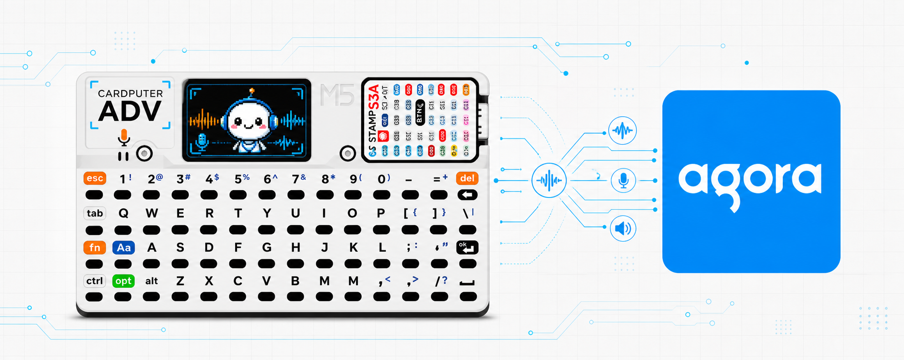

## Table Of Contents

- [🤖 Cardputer Voice Agent With Agora Conversational AI](#-cardputer-voice-agent-with-agora-conversational-ai)
- [🚀 Quickstart](#-quickstart)
  - [✨ Option 1: Use Your AI Coding Tool](#-option-1-use-your-ai-coding-tool)
  - [🛠️ Option 2: Manual Setup](#️-option-2-manual-setup)
- [💻 Develop With PlatformIO](#-develop-with-platformio)

# 🤖 Cardputer Voice Agent With Agora Conversational AI

Run an Agora Conversational AI voice agent on M5Stack Cardputer ADV. The firmware connects over Wi-Fi to a local quickstart server, joins Agora RTSA, and lets you talk with the agent from the Cardputer.

## 🚀 Quickstart

This firmware talks to a local voice agent server. The easiest server path is Agora's official Conversational AI quickstart:

<https://github.com/AgoraIO-Conversational-AI/agent-quickstart-python>

Run that server on your PC, keep the Cardputer and your PC on the same Wi-Fi, then use your PC's LAN address on port `8000` as the firmware server URL, for example `http://192.168.0.101:8000`.

### ✨ Option 1: Use Your AI Coding Tool

This is the recommended path. The setup touches the firmware repo, Agora project setup, the local voice agent server, LAN IP discovery, and device flashing; an AI coding tool can follow the full checklist in `docs/ai-quickstart.md` and reduce manual mistakes.

If you use Codex, Claude Code, Cursor, Windsurf, Copilot, or another AI coding assistant, install Agora's skill first so the assistant has Agora-specific setup guidance:

```bash
npx skills add github:AgoraIO/skills
```

Agora Skills: <https://github.com/AgoraIO/skills>

Then open this repo in your AI coding tool and use a prompt like this:

```text
Use the Agora skill from https://github.com/AgoraIO/skills.
Follow docs/ai-quickstart.md to set up this Cardputer voice agent project with Agora Conversational AI.
Keep secrets only in ignored local config files and do not print them.
```

When the build works, upload and monitor from the terminal:

```bash
pio run -t upload
pio device monitor
```

Press `k` on the Cardputer keyboard to start the agent.

### 🛠️ Option 2: Manual Setup

Manual setup follows the same flow as `docs/ai-quickstart.md`, but you run each step yourself.

Before configuring the server, use Agora CLI to create or prepare an Agora project with the required features enabled and retrieve the App ID and App Certificate:

```bash
curl -fsSL https://raw.githubusercontent.com/AgoraIO/cli/main/install.sh | sh -s -- --add-to-path
```

Follow the Agora CLI prompts to log in, select or create a project, enable the mandatory features for Conversational AI, and get the project credentials.

Set up the local voice agent server first:

```bash
git clone https://github.com/AgoraIO-Conversational-AI/agent-quickstart-python.git
cd agent-quickstart-python
bun install
cd server-python
cp .env.example .env.local
```

Edit `server-python/.env.local` and set the Agora `APP_ID` and `APP_CERTIFICATE` from the CLI-created or CLI-selected project.

Start both the web client and backend:

```bash
cd ..
bun run dev
```

The backend will be available at `http://localhost:8000`. If you only want the backend, run:

```bash
bun run backend
```

Find your PC's LAN IP address. Your Cardputer must be connected to the same Wi-Fi network as your PC. Use `http://<your-pc-lan-ip>:8000` as the firmware protocol server URL, for example `http://192.168.0.101:8000`.

Install PlatformIO if you do not already have it:

```bash
pipx install platformio
```

Create your local ignored config:

```bash
cp src/app_config.local.example.h src/app_config_local.h
```

Edit `src/app_config_local.h` and set:

```c
#define APP_WIFI_SSID "your-wifi-ssid"
#define APP_WIFI_PASSWORD "your-wifi-password"
#define APP_PROTOCOL_BASE_URL "http://your-pc-lan-ip:8000"
```

Build the firmware:

```bash
pio run
```

Put the Cardputer in upload mode:

1. Unplug USB.
2. Switch power off.
3. Hold `G0`.
4. Plug USB back in.
5. Start upload.
6. Release `G0` after writing begins.

Upload and monitor:

```bash
pio run -t upload
pio device monitor
```

On a working run, the serial monitor should show Wi-Fi connection, protocol config, RTSA join, and agent start logs. Press `k` on the Cardputer keyboard to start the agent.

## 💻 Develop With PlatformIO

Open this repo in VS Code and install the PlatformIO IDE extension. PlatformIO should detect the `cardputer-whip` environment from `platformio.ini`.

Useful PlatformIO actions:

- Build: compiles the voice-agent firmware.
- Upload: flashes the connected Cardputer.
- Monitor: opens the serial monitor at `115200` baud.
- Upload and Monitor: flashes the device, then opens serial logs.

Equivalent CLI commands:

```bash
pio run
pio run -t upload
pio device monitor
```

The project is configured for:

- PlatformIO environment: `cardputer-whip`
- Board: `esp32-s3-devkitc-1`
- Framework: ESP-IDF
- Flash size: 8 MB
- Upload speed: `115200`
- Monitor speed: `115200`

Keep local credentials and server URLs in `src/app_config_local.h`. That file is git-ignored and overrides the placeholder defaults from `src/app_config.h`.
